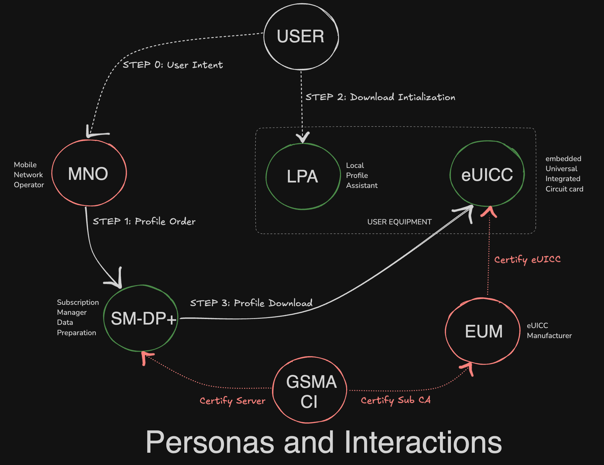

# How eSIM works?

- **Consumer** : Sends intent by selecting a telco/data plan from an array or list of plans provided by MNO(Mobile Network Operator).
- **MNO** : Orders SM-DP+(Subscription Manager Data Preparation) to create an eSIM profile of the selected telco/data plan and delivers it to respective user device.
- **SM-DP+** : A server-side platform that manages eSIM profiles, prepares eSIM profiles with carrier information and credentials, enables communication between the device and the carrier network via LPA(Local Profile Assistant) and securely stores and delivers eSIM profiles to devices.
- **LPA** : A system application, a software component within eSIM-enabled devices that manages eSIM profiles, interacts with the eUICC(embedded Universal Integrated Circuit Card) chip within the device to store and manage eSIM profile, enabling seamless downloading, installation, and management of mobile network profiles without needing physical SIM cards.
- **eUICC Chip** : Simply put, it's a SIM card component that lets you switch mobile network operators (MNOs) remotely.
