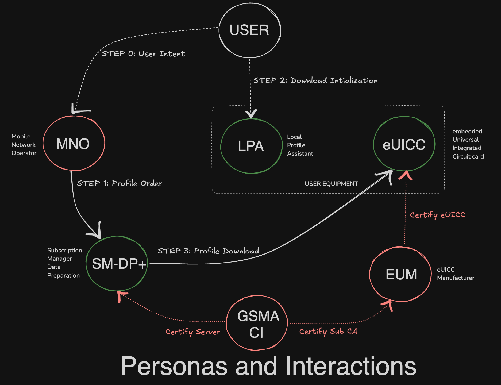

# How eSIM provisioning works {#how-esim-provisioning-works}

Buying an eSIM sets five parties in motion, and they are the same five whether you buy from a carrier or from Kokio. Understanding them is what makes the rest of this documentation readable: [Kokio's own contracts](../contracts/overview.md) sit alongside this chain rather than replacing it, recording who owns the purchase while the provisioning itself runs the standard way.

- **Consumer** : Sends intent by selecting a telco/data plan from an array or list of plans provided by MNO(Mobile Network Operator).
- **MNO** : Orders SM-DP+(Subscription Manager Data Preparation) to create an eSIM profile of the selected telco/data plan and delivers it to respective user device.
- **SM-DP+** : A server-side platform that manages eSIM profiles, prepares eSIM profiles with carrier information and credentials, enables communication between the device and the carrier network via LPA(Local Profile Assistant) and securely stores and delivers eSIM profiles to devices.
- **LPA** : A system application, a software component within eSIM-enabled devices that manages eSIM profiles, interacts with the eUICC(embedded Universal Integrated Circuit Card) chip within the device to store and manage eSIM profile, so mobile network profiles can be downloaded, installed and managed without a physical SIM card.
- **eUICC Chip** : Simply put, it's a SIM card component that lets you switch mobile network operators (MNOs) remotely.
